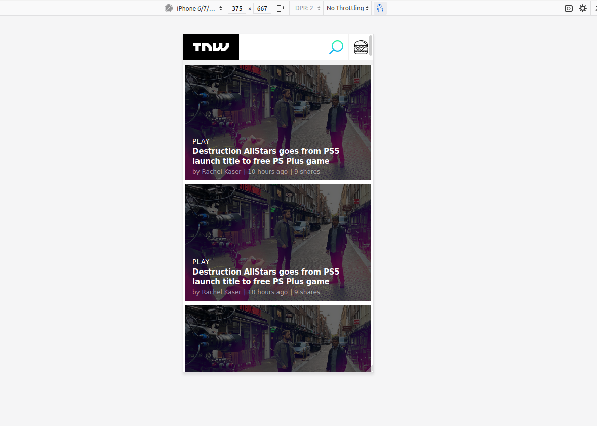

## Cloning the TNW(https://thenextweb.com/) Homepage using a mobile first approach different positioning methods and making the webpage responsive.

    This is a project that clones the TNW Home Page. The purpose of this project is to practice positioning, gradient & media queries.

    Break Points:

    Mobile Site - Minimum Width - 375px
    Tablet Site - Minimum Width - 768px
    Desktop Site - Minimum Width - 1024px

## Built With

- Html,
- CSS,
- Linter,
- VS Code

## Live Demo

[Live Demo Link](https://rawcdn.githack.com/kunmi02/TNW/5c30e60cb2b94b7537ddf4e2fdf6a26e4abe01b0/index.html)

## Automated Test

> There are no automated tests for this project yet.

## Authors

👤 **Author1**

- Github: [@akshay-narkar]
- Twitter: [@akidoit]

👤 **Author2**

- Github: [@kunmi02]
- Twitter: [@akinkunmi006]

## 🤝 Contributing

Contributions, issues and feature requests are welcome! Start by:

- Forking the project
- Cloning the project to your local machine
- `cd` into the project directory
- Run `git checkout -b your-branch-name`
- Make your contributions
- Push your branch up to your forked repository
- Open a Pull Request with a detailed description to the development branch of the original project for a review

## Show your support

Give a :star: if you like this project!

## 📝 License

This project is [MIT](https://opensource.org/licenses/MIT) licensed.
